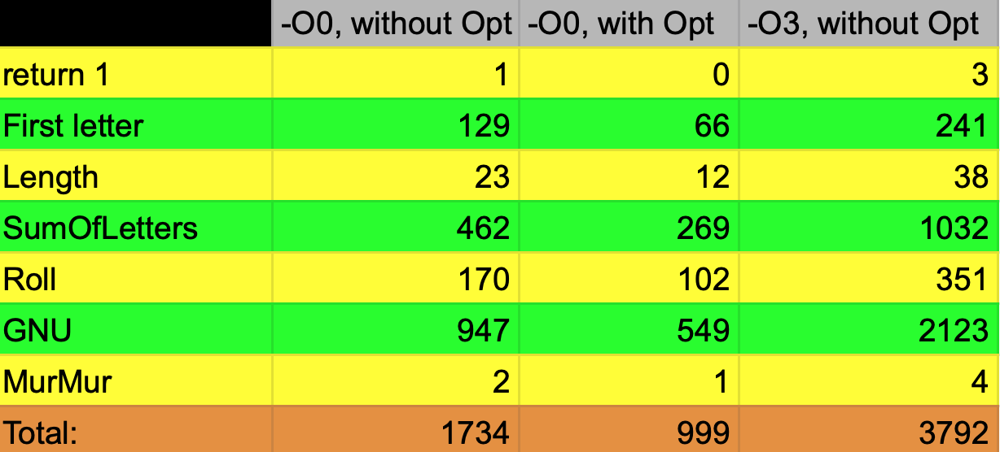
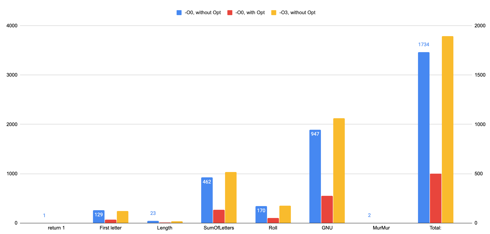

# Description 
This project is a try to make Hash-Table( https://github.com/AlbatraozRUS/Hash-Table), which was created earlier, work faster by rewriting parts of code in ASM.
# Analyze 
After analyzing the code, i have found a weakness: the proccess of searching elemenent in Hash-Table. Because it is one of the most important functions of project, i have decided to write ASM function, which should work faster, than same on C. 
So this is code of what we had initially:
``` C
bool SearchByValue(MyList *Table, char *Value)
{
    for (int NumTable = 0; NumTable < SizeOfTable; NumTable++){
        for (int NumOfList = 0; NumOfList <= Table[NumTable].size; NumOfList++){
        
         if (Table[NumTable].Element[NumOfList].data == nullptr)
             continue;

         if (strcmp(Table[NumTable].Element[NumOfList].data, Value) == 0)
             return true;         
        }
    }
    return false;
}
```
Using http://godbolt.org we have code generated by gcc without any default optimization (-O0)
``` asm
_Z13SearchByValueP6MyListPc:
        push    rbp
        mov     rbp, rsp
        sub     rsp, 32
        mov     QWORD PTR [rbp-24], rdi
        mov     QWORD PTR [rbp-32], rsi
        mov     DWORD PTR [rbp-4], 0
.L8:
        cmp     DWORD PTR [rbp-4], 99
        jg      .L2
        mov     DWORD PTR [rbp-8], 0
.L7:
        mov     eax, DWORD PTR [rbp-8]
        movsx   rcx, eax
        mov     eax, DWORD PTR [rbp-4]
        movsx   rdx, eax
        mov     rax, rdx
        sal     rax, 2
        add     rax, rdx
        sal     rax, 3
        mov     rdx, rax
        mov     rax, QWORD PTR [rbp-24]
        add     rax, rdx
        mov     rax, QWORD PTR [rax+24]
        cmp     rcx, rax
        ja      .L3
        mov     eax, DWORD PTR [rbp-4]
        movsx   rdx, eax
        mov     rax, rdx
        sal     rax, 2
        add     rax, rdx
        sal     rax, 3
        mov     rdx, rax
        mov     rax, QWORD PTR [rbp-24]
        add     rax, rdx
        mov     rax, QWORD PTR [rax]
        mov     edx, DWORD PTR [rbp-8]
        movsx   rdx, edx
        sal     rdx, 4
        add     rax, rdx
        mov     rax, QWORD PTR [rax]
        test    rax, rax
        je      .L9
        mov     eax, DWORD PTR [rbp-4]
        movsx   rdx, eax
        mov     rax, rdx
        sal     rax, 2
        add     rax, rdx
        sal     rax, 3
        mov     rdx, rax
        mov     rax, QWORD PTR [rbp-24]
        add     rax, rdx
        mov     rax, QWORD PTR [rax]
        mov     edx, DWORD PTR [rbp-8]
        movsx   rdx, edx
        sal     rdx, 4
        add     rax, rdx
        mov     rax, QWORD PTR [rax]
        mov     rdx, QWORD PTR [rbp-32]
        mov     rsi, rdx
        mov     rdi, rax
        call    strcmp
        test    eax, eax
        jne     .L5
        mov     eax, 1
        jmp     .L6
.L9:
        nop
.L5:
        add     DWORD PTR [rbp-8], 1
        jmp     .L7
.L3:
        add     DWORD PTR [rbp-4], 1
        jmp     .L8
.L2:
        mov     eax, 0
.L6:
        leave
        ret
```
Not so fast, isn`t it?
# Result 
After some time of analyzing, speed measurements of commands and other staff, i have rewrited it
``` asm
global SearchByValue
extern strcmp

section .text

SearchByValue:
       push r13
       push r12
       push r15
       push rbx
       mov     rcx, 1000
       mov     r13, rdi
  .Around:
         mov     r12, QWORD  [r13+8]
         mov     r15, QWORD  [r13]
         xor     ebx, ebx
      .Inside:
             cmp     rbx, r12
             ja     .AroundNext
             mov     rdi, QWORD  [r15]
             test    rdi, rdi
             je      .InsideNext
             call    strcmp
             test    eax, eax
             je      .Found
      .InsideNext:
             inc     rbx
             add     r15, 16
             jmp .Inside
  .AroundNext:
         add     r13, 40
         dec     rcx
         test    ecx, ecx
         jne     .Around
         xor     rax, rax
.EXX:
         pop rbx
         pop r15
         pop r12
         pop r13
         ret
.Found:
       mov     rax, 1
       jmp .EXX

```
But what about speed? 


Pretty interesting, yeah? Somehow code generated with -O0 is twice faster than -O3. *(By secret i will tell you, that it is faster only in search function, summary -O3 is twice faster)*.
But, despite it, **i have successfully overtaked both -O0(more than 1,72 times) and -O3(more than 3,57 times).** 
